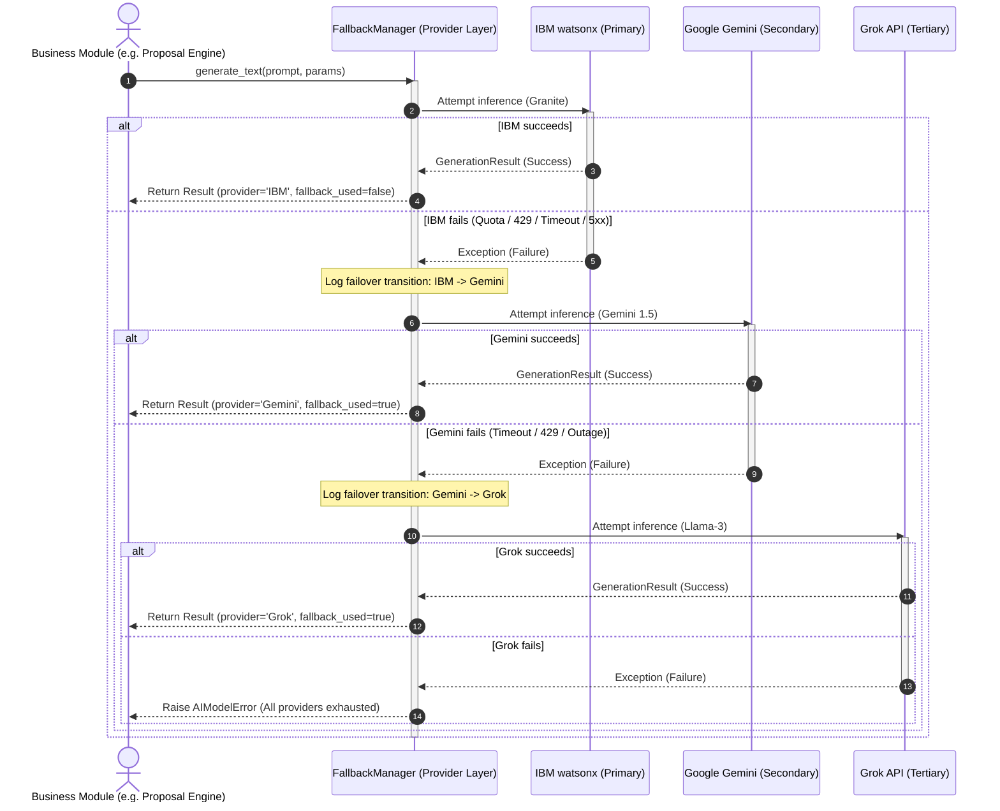

# System Architecture & Fallback Flow Diagram

This document illustrates the FundForge AI component topology and the execution flow of the resilient AI Provider Fallback Engine.

---

## 🏗️ Component Architecture Diagram

The multi-tier architecture separates frontend interaction, authentication, local deterministic rules checking, vector-based semantic retrieval, and external AI providers:

```mermaid
graph TD
    %% Clients
    Browser["React SPA (Client)"]

    %% Gateway / Server
    subgraph Gateway ["Reverse Proxy & Web Server"]
        Nginx["Nginx reverse proxy"]
    end

    %% Backend Flask
    subgraph Backend ["Flask Application Server"]
        AuthCtrl["Auth Controller"]
        EligCtrl["Eligibility Controller"]
        PropCtrl["Proposal Controller"]
        RAGCtrl["RAG QA Controller"]
        
        %% Engines
        EligEngine["Eligibility Rules Engine"]
        RAGEngine["watsonx RAG Index"]
        PropEngine["Proposal Assembly Engine"]
        
        %% Core Provider Interface
        BaseAI["BaseAIProvider Interface"]
    end

    %% Database & Cache
    subgraph Data ["Persistence & Caching"]
        Postgres[(PostgreSQL DB)]
        Redis[(Redis Cache & Tasks)]
    end

    %% Resiliency & AI Layer
    subgraph AISec ["AI Provider Failover Chain"]
        Fallback["FallbackManager"]
        IBM["IBM watsonx.ai (Granite)"]
        Gemini["Google Gemini API (1.5 Flash)"]
        Grok["Grok API (Groq Llama-3)"]
    end

    %% Flows
    Browser -->|HTTP requests| Nginx
    Nginx -->|Proxy pass| AuthCtrl & EligCtrl & PropCtrl & RAGCtrl
    
    AuthCtrl -->|Read/Write Startup Profiles| Postgres
    EligCtrl -->|Evaluate Rules| EligEngine
    RAGCtrl -->|Retrieve Chunks| RAGEngine
    PropCtrl -->|Orchestrate Draft| PropEngine
    
    PropEngine --> BaseAI
    RAGCtrl --> BaseAI
    
    BaseAI --> Fallback
    
    Fallback -->|Attempt 1| IBM
    Fallback -->|Attempt 2 (on failure)| Gemini
    Fallback -->|Attempt 3 (on failure)| Grok
    
    Nginx -->|Serve static files| Browser
```

---

## 🔄 Fallback Execution Sequence

When a business module requests text generation, the request flows through `FallbackManager`. Failover cascades seamlessly without user intervention:



---

## 📈 Auto-Recovery Mechanics

1. **State Independence**: The `FallbackManager` remains completely stateless with respect to provider locking. For every new request, it always tries the primary provider (IBM) first.
2. **Immediate Restoration**: When the primary provider's service is restored (e.g., token quota resets at the top of the hour or network latency clears), the next call to `generate_text` succeeds on step 1, automatically routing traffic back to IBM without restarts or configuration changes.
